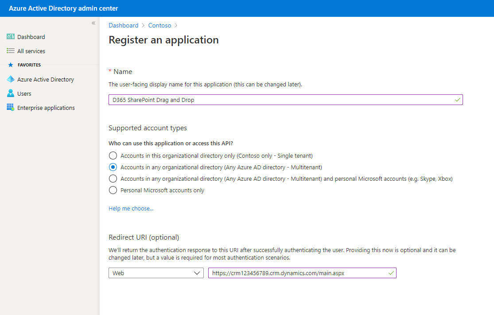
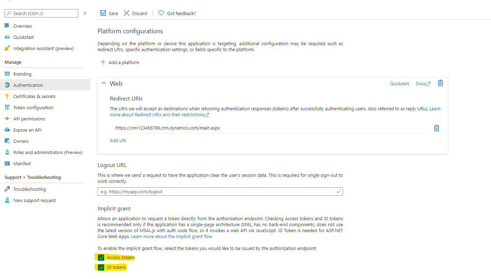
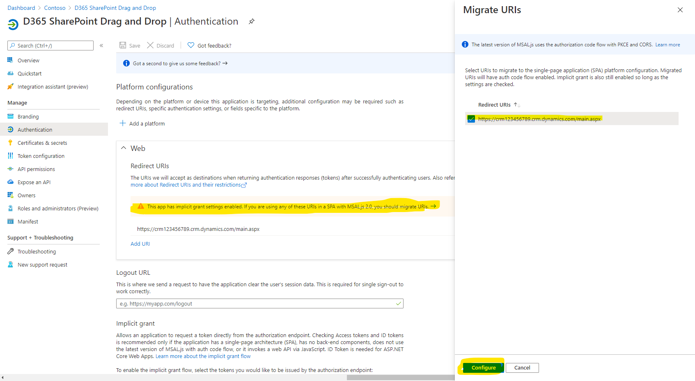
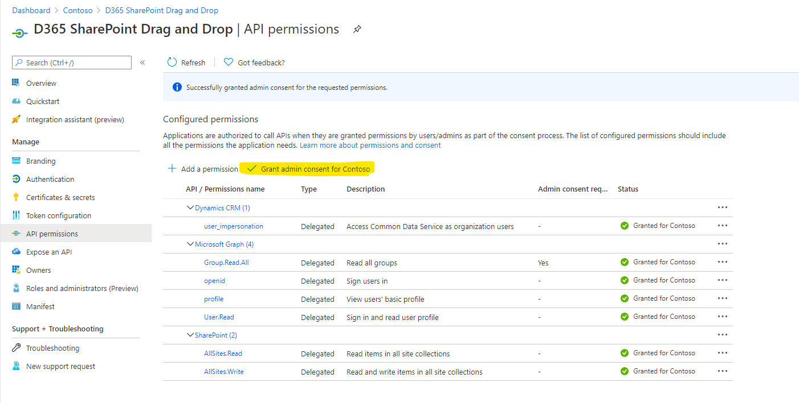
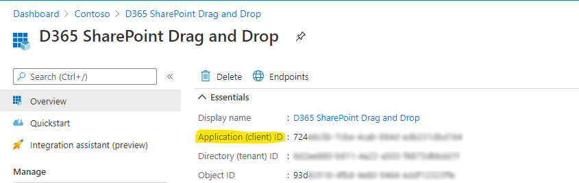
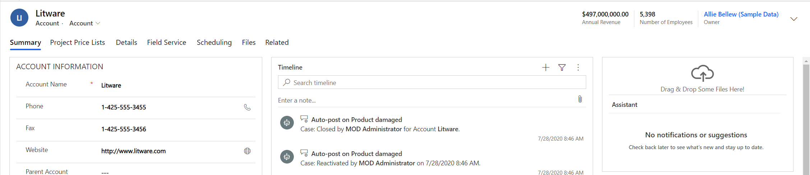
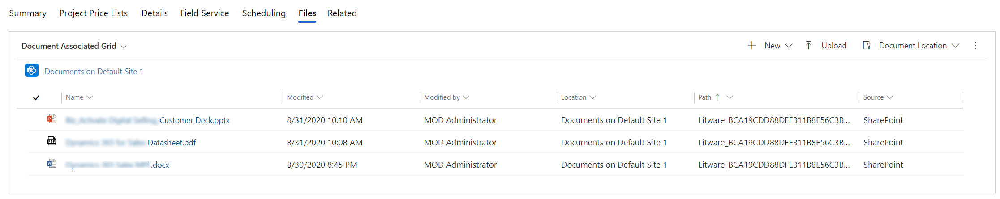

# SharePoint Drag & Drop PCF

A PCF control to drag and drop files to SharePoint libraries.

### Configure Azure Active Directory

This control uses Azure Implicit Grant for Authentication.  This will require setting up an Azure App Registration so that your PCF control can 'talk' to SharePoint.

##### Step 1 
Create a new App registration in AAD.  Enter the URL of your D365 instance (including the 'main.aspx') in the Redirect URI field.

##### Step 2
Check the two boxes to indicate that you will be using Access tokens and ID tokens and click Save.

##### Step 3
After saving, you will get a warning that you should migrate your URI to a SPA.  Click the arrow to the left and then click 'Configure' to move the URI to a Single Page Application.

###### Step 4 
Next, assign the following API permissions to the App and click the 'Grant admin consent' button.

###### Step 5
Before leaving Azure AD, note the Application ID (client id) from the Overview tab of the registration.  You will need this later when setting up the control.

### Adding Control to D365/CDS
After your Azure AD configuration is complete, upload the control solution to CDS/D365 and configure a field on the form to render the control.

Note: Turn off the native field label on the control so it renders better.

###### Step 1
Add the control to the field and set the following bindings:

* <b>boundEntityField</b> - This is the field that the control is being bound to.
* <b>ClientId</b> - This is the Azure AD Application ID from step 5 above.
* <b>SharePointSiteGuid</b> - This is the Guid of the SharePoint Site record in CDS.  
<i><b> Note: You can find this by opening the site record and looking at the URL.</i></b>
* <b>UseRelationship</b> - This tells the control if it will use a relationship folder structure for storing documents.  
<i><b>Example: In the image below this is control is added to the Opportunity form so setting this to 'true' will store files in a folder hierarchy if SharePoint is configured to use it in your CDS environment.</i></b>
* <b>PrimaryEntityFieldLogicalName</b> - This is the primary logical 'name' field for the entity that you are adding the control to.  Typically this is 'name' for an OOB entity or 'prefix-name' for a custom entity.
* <b>RelationshipLogicalName</b> - This is the logical name of the relationship to the parent entity (account or contact) of this record.  For Opportunity this is using the relationship of 'parentaccountid' so that attachments are uploaded to the correct parent folder.
* <b>ParentEntityTypeName</b> - Typically this should be 'account' or 'contact' and should match the what is configured for the folder entity structure in your SharePoint setup in CDS.
* <b>ParentEntityPrimaryFieldName</b> - This should almost always be 'name' unless you are somehow using this control with a relationship hierarchy other than account or contact.

###### Step 2
Test the control.
Drag and drop one or multiple files onto the control.

After the files upload, check the Files tab to verify they have uploaded properly to SharePoint.
